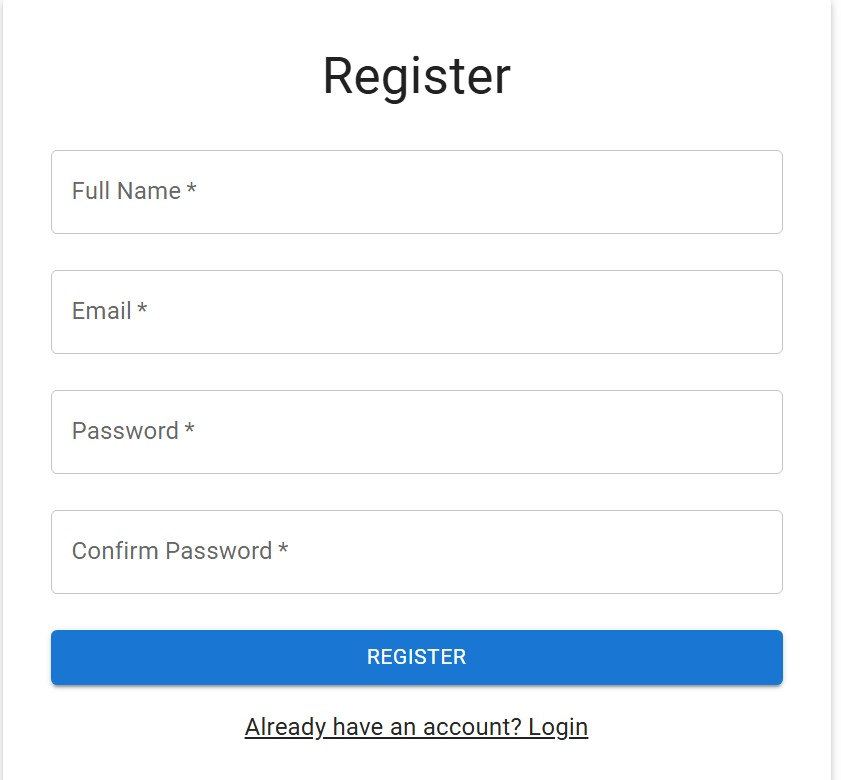
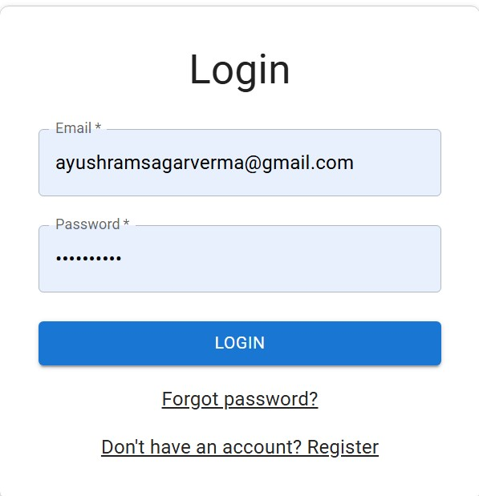
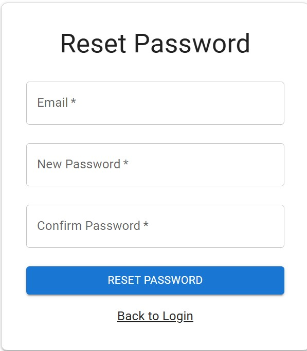
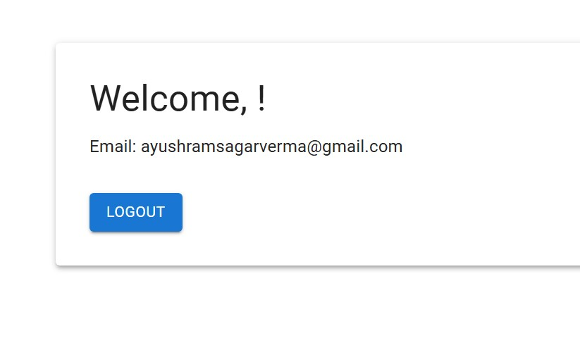

# Authentication System

A Basic authentication system with user registration, login, and password reset functionality.

## Project Structure

```
authentication andauthorisation/
├── backend/                # Backend Node.js/Express server
│   ├── config/            # Configuration files
│   │   └── database.js    # Database configuration
│   ├── models/            # Sequelize models
│   │   └── User.js       # User model
│   ├── routes/            # API routes
│   │   └── auth.js       # Authentication routes
│   ├── .env              # Environment variables (DO NOT COMMIT)
│   ├── .env.example      # Example environment variables
│   ├── package.json      # Backend dependencies
│   └── server.js         # Main server file
├── frontend/              # Frontend React application
│   ├── public/           # Static assets
│   └── src/              # React components and code
├── results/              # Project screenshots
│   ├── Registerpage.jpg             # User registration form with  fields for name, email, and password
│   ├── loginpage.jpg             # User login form with fields for email and password
│   ├── resetpasswordpge.jpg             # Password reset form with fields for email and new password
│   └── welcomepage.jpg             # Welcome page after successful login
```

## Features

- User Registration
- User Login
- Password Reset
- Input Validation
- Error Handling
- Database Integration

## Prerequisites

- Node.js (v14 or higher)
- MySQL Database
- npm or yarn

## Backend Setup

1. Install dependencies:
```bash
# Navigate to backend directory
cd backend
npm install
```

2. Create a `.env` file in the backend directory with the following variables:
```env
DB_NAME=your_database_name
DB_USER=your_database_user_name
DB_PASSWORD=your_database_password
DB_HOST=your_database_host
PORT=5000
DB_DIALECT=your_database_type
```

3. Start the backend server:
```bash
# Development mode (with hot-reload)
npm run dev

# Production mode
npm start
```

## Frontend Setup

1. Navigate to the frontend directory:
```bash
cd frontend
```

2. Install dependencies:
```bash
npm install
```

3. Start the development server:
```bash
npm start
```

## API Endpoints

### Authentication

- `POST /api/auth/register` - Register a new user
- `POST /api/auth/login` - User login
- `POST /api/auth/reset-password` - Reset user password
- `GET /api/health` - Health check endpoint

## Database

The project uses MySQL database with Sequelize ORM. The database schema includes:

- Users table with fields: id, name, email, password

## Project Screenshots

### Screenshots


User registration form with fields for name, email, and password


User login form with email and password fields, and "Forgot Password?" link


Password reset form with fields for email and new password


Welcome page shown after successful login
